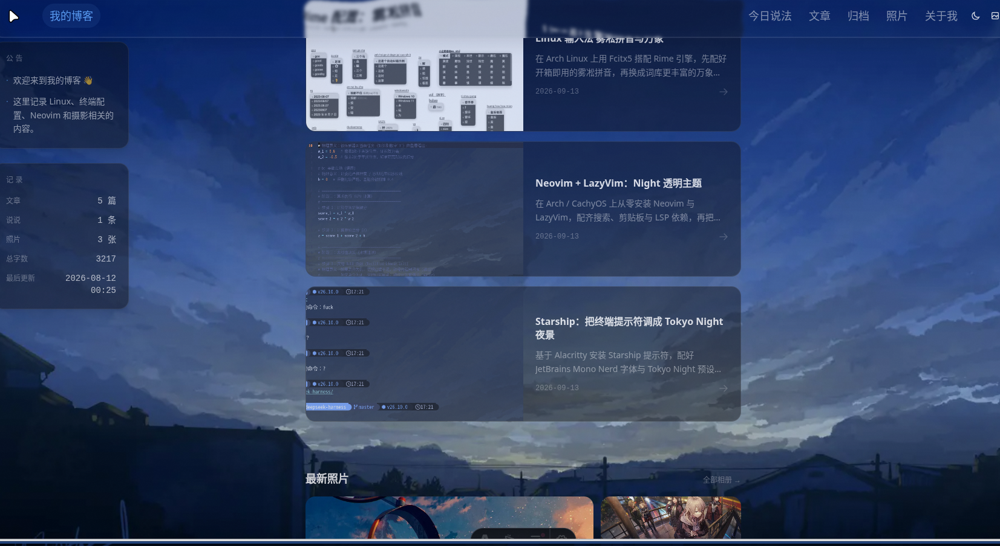
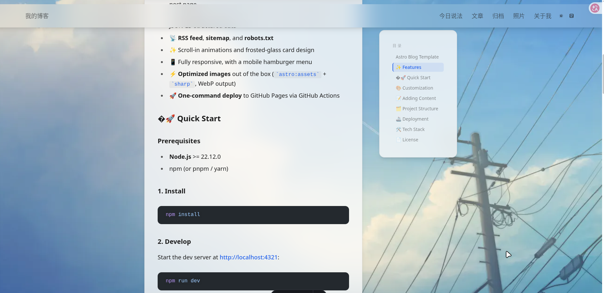
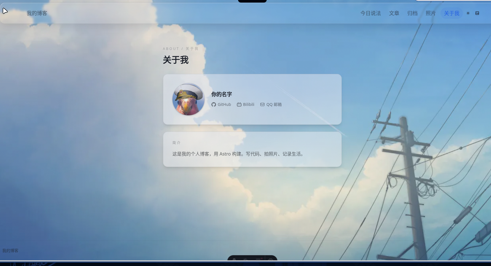
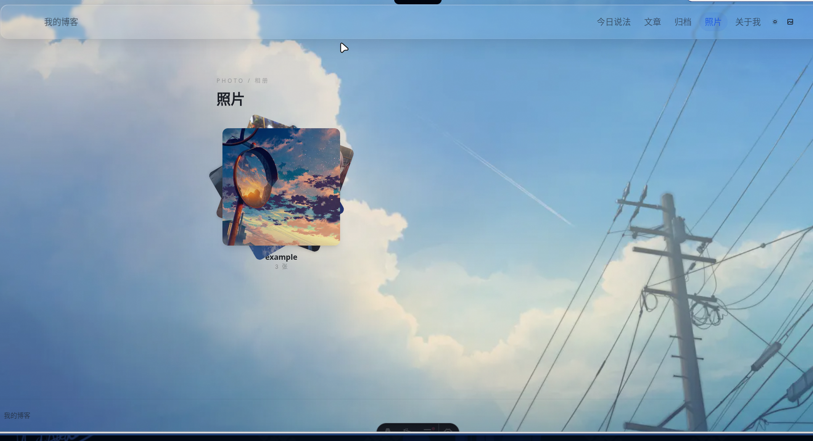

# Astro 博客模板

一个现代、高颜值的个人博客模板，基于 **Astro** 与 **Tailwind CSS** 构建 —— 全静态、默认零客户端 JavaScript。主页、归档、相册、今日说法、关于页全部开箱即用，只需要改一个配置文件就能完成个性化定制。

构建产物输出在 `dist/` 文件夹内。

[](https://astro.build)
[](https://tailwindcss.com)
[](LICENSE)
[](https://nodejs.org)

> **简体中文** | [English](./README.en.md)

> 🌐 在线演示：<https://ruijieking.github.io>

## 📸 预览



## ✨ 功能特性


- 🏠 **完整首页** —— 自动汇总最新的「今日说法 / 文章 / 照片」三块内容，无需手动维护
- 📢 **公告栏** —— 首页左侧悬浮侧栏，内容在配置里一行一条
- 📊 **记录栏** —— 自动统计文章数、说说数、照片数、总字数，并读取仓库最后一次更新时间
- 🖼️ **文章封面图** —— frontmatter 加一行 `cover` 即可，列表卡片左侧自动显示
- 👤 **关于页** —— 头像卡片 + 社交链接（GitHub / B 站 / 邮箱…，内置 SVG 图标）+ 简介卡片
- 🧊 **液态玻璃导航栏** —— 用 SVG 位移滤镜做出水下折射波纹（Chromium 生效），其它浏览器自动降级为普通毛玻璃
- 🌗 **明暗主题切换** —— 防首屏闪烁（FOUC），自动记忆你的选择
- 🖼️ **壁纸系统** —— 明暗主题各配一套壁纸，交叉淡入淡出过渡，按主题分别记忆
- 📝 **博客文章** —— 基于 Astro content collections（标题、描述、日期、分类、标签、封面）
- 📚 **归档时间轴** —— 按年份分组，支持**即时搜索**和**多标签过滤**
- 💬 **今日说法** —— 轻量级碎碎念 / 短笔记板块
- 📷 **照片相册** —— 文件夹即相册，三层叠加封面 + **灯箱（Lightbox）** 大图查看
- 📑 **文章目录** —— 从文章标题自动生成，点击平滑滚动
- 🔍 **完整 SEO** —— Open Graph、Twitter Cards、canonical 链接、JSON-LD 结构化数据
- 📡 **RSS 订阅**、**sitemap**、**robots.txt**
- ✨ 滚动入场动画 + 磨砂玻璃卡片设计
- 📱 完全响应式，移动端汉堡菜单
- ⚡ **图片自动优化**（`astro:assets` + `sharp`，输出 WebP）
- 🚀 **一键部署**到 GitHub Pages（GitHub Actions 自动构建）

## 🏠 首页结构

```
英雄区（站名 + 描述，水平居中）
├── 左侧栏（≥1280px 才显示，吸附在导航栏下方；窄屏与手机直接隐藏）
│   ├── 公告栏 —— 内容来自 site.config.ts 的 notices
│   └── 记录栏 —— 文章数 / 说说数 / 照片数 / 总字数 / 仓库最后更新时间
└── 主内容（始终水平居中，宽度固定 720px）
    ├── 今日说法   → 取最新 2 条
    ├── 最新文章   → 取最新 3 篇
    └── 最新照片   → 取最新相册的前 3 张
```

> 记录栏的「最后更新」在**构建时**读取 `statsRepo` 指定的 GitHub 仓库提交时间（走 Atom feed，免认证、无限流）。读取失败会自动降级为本地 git 提交时间，再降级为最新文章的发布日期，**任何一级失败都不会让构建挂掉**。把 `statsRepo` 留空则这一项不显示，其它统计照常。

## 📸 截图

| 文章详情 | 关于我 | 照片 |
| --- | --- | --- |
|  |  |  |

## 🚀 快速开始

### 环境要求

- **Node.js** >= 22.12.0
- npm（或 pnpm / yarn）

### 1. 安装依赖

```bash
npm install
```

### 2. 本地开发

启动开发服务器，访问 <http://localhost:4321>：

```bash
npm run dev
```

### 3. 构建与预览

```bash
npm run build     # 输出到 dist/
npm run preview   # 预览生产构建
```

## 🎨 个性化配置

站点所有个性化配置都在**一个文件**里：`src/site.config.ts`。改一次，全站自动更新。

```ts
export const site = {
  // 网站名称（导航栏 logo、页脚、页面标题后缀、SEO）
  name: '我的博客',
  defaultTitle: '我的博客',
  description: '写代码、拍照片、记录生活。',

  // SEO：站点域名（必须带 https://，canonical / sitemap / robots.txt 依赖它）⭐⭐⭐
  url: 'https://example.com',
  ogImage: '/og.png',                  // 社交分享图（public/ 下，建议 1200×630）
  ogSiteName: '我的博客',               // 分享卡片上显示的站点名

  // 作者信息
  author: {
    name: '你的名字',
    github: 'your-github-username',
    // 关于页头像：填 public/ 下的路径（如 '/avatar.png'）或完整图片 URL
    // 留空则自动使用 GitHub 头像 https://github.com/<github>.png
    avatar: '',
  },

  // 关于页面的介绍文字
  about: '这是我的个人博客，用 Astro 构建。',

  // ── 首页左侧「公告栏」──
  // 一行一条，按数组顺序显示；留空数组则不显示公告栏
  notices: [
    '欢迎来到我的博客 👋',
    '这里会记录一些随手写的东西。',
  ],

  // ── 首页「记录栏」最后更新的数据源 ──
  // 填 '用户名/仓库名'（如 'ruijieking/New-blog-v3'）→ 构建时读取该仓库最后一次提交时间
  // 留空 或 读取失败 → 降级用本地 git 提交时间，再取不到则用最新文章日期
  statsRepo: '',

  // ── 关于页社交链接（自左向右排列）──
  // icon 可选：github / bilibili / mail / telegram / twitter / rss（其它值显示通用图标）
  // href 支持 https:// 或 mailto:；不想显示某一项就删掉那一行
  socials: [
    { label: 'GitHub',   href: 'https://github.com/your-name',       icon: 'github' },
    { label: 'Bilibili', href: 'https://space.bilibili.com/你的UID',  icon: 'bilibili' },
    { label: 'QQ 邮箱',  href: 'mailto:你的QQ号@qq.com',              icon: 'mail' },
  ],

  // 导航栏（href + 显示文字，数组顺序即显示顺序）
  nav: [
    { href: '/talk', label: '今日说法' },
    { href: '/blog', label: '文章' },
    { href: '/archive', label: '归档' },
    { href: '/photo', label: '照片' },
    { href: '/about', label: '关于我' },
  ],
};
```

## 📝 添加内容

### 博客文章

在 `src/content/blog/` 下新建 Markdown 文件：

```md
---
title: '你好，世界'           # 必填
description: '我的第一篇文章' # 必填
pubDate: '2026-01-01'         # 必填   
category: '生活'              # 可选
tags: ['astro', '博客']       # 可选
cover: '/covers/我的封面.png' # 可选，列表卡片的封面图（图片放 public/covers/ 下）
coverAlt: '一张终端截图'       # 可选，封面图 alt，不写则用文章标题
---

正文内容…
```

### 文章封面图

把图片放进 `public/covers/`，然后在 frontmatter 里加一行即可。推荐 **1200 × 675（16:9）**，其它比例会被 `object-cover` 裁切：

```yaml
cover: '/covers/我的封面.png'
coverAlt: '一张终端截图'
```

不写 `cover` 的文章，列表里会显示一个文档图标占位，不影响排版。

### 今日说法

在 `src/content/talk/` 下新建 Markdown 文件：

```md
---
update: '2026-01-01-12:00'
---

短句内容…
```

### 照片相册

在 `src/assets/album/` 下新建文件夹 —— **每个文件夹就是一个相册，文件夹名字就是照片的名字**，里面的图片自动展示：

```
src/assets/album/
├── 旅行/          ← 相册：「旅行」
│   ├── photo1.jpg
│   └── photo2.png
└── 日常/
    └── photo3.jpg
```

### 壁纸

把壁纸放到 `src/assets/wallpaper/` 下：

```
src/assets/wallpaper/
├── light/         ← 浅色主题显示的壁纸
└── dark/          ← 深色主题显示的壁纸
```

命名为 `默认light.png` / `默认dark.png` 的文件（或每个文件夹里的第一张图）会被用作默认壁纸。

## 🗂️ 项目结构

```
├── public/
│   ├── covers/             # 文章封面图（frontmatter 里用 '/covers/xx.png' 引用）
│   ├── favicon.*
│   └── og.png              # 社交分享图
├── src/
│   ├── assets/
│   │   ├── album/          # 照片相册（文件夹 = 相册）
│   │   └── wallpaper/      # 主题壁纸（light/ dark/）
│   ├── components/         # UI 组件
│   │   ├── NoticeBoard.astro    # 首页公告栏
│   │   ├── SiteStats.astro      # 首页记录栏（文章/照片/字数/最后更新）
│   │   ├── Post.astro           # 文章列表卡片（含封面图）
│   │   ├── AlbumCard.astro      # 相册卡片
│   │   ├── Archive.astro        # 归档时间轴
│   │   ├── TalkList.astro       # 今日说法列表
│   │   ├── Icon.astro           # 内置 SVG 图标（无图标库依赖）
│   │   ├── AnimateIn.astro      # 入场动画包装
│   │   ├── ThemeToggle.astro    # 明暗主题切换
│   │   └── WallpaperPicker.astro
│   ├── content/
│   │   ├── blog/           # 博客文章（.md）
│   │   └── talk/           # 今日说法（.md）
│   ├── layouts/            # BaseLayout（主题、壁纸、SEO、导航栏、液态玻璃滤镜）
│   ├── pages/              # 页面路由
│   ├── styles/global.css   # Tailwind 入口 + 主题色变量
│   ├── content.config.ts   # 内容集合 schema
│   └── site.config.ts      # ⭐ 全局站点配置
├── astro.config.mjs
├── package.json
└── tsconfig.json
```

## 🚢 部署

### GitHub Pages（不做后端非常推荐，因为部署简单免费）

项目自带的 `.github/workflows/deploy.yml` 会在每次 push 到 `main` 时自动构建并部署：

1. 把这个模板推送到一个 GitHub 仓库；
2. 打开 **Settings → Pages**，把 Source 设置为 **GitHub Actions**；
3. 完成 —— 之后每次 push 到 `main` 都会自动重新构建并部署。

### 其他平台

这是一个纯静态站点 —— 执行 `npm run build` 后把 `dist/` 文件夹部署到任意托管平台即可：

- **Netlify**：构建命令 `npm run build`，发布目录 `dist`
- **Vercel**：框架预设选择 **Astro**
- **Cloudflare Pages**：构建命令 `npm run build`，输出目录 `dist`

> 💡 记得在 `src/site.config.ts` 里把 `site.url` 设为你的线上域名，canonical、sitemap、robots.txt 才会正确生成。

## 🛠️ 技术栈

| 工具 | 用途 |
|---|---|
| [Astro](https://astro.build) 7 | 静态站点框架 |
| [Tailwind CSS](https://tailwindcss.com) 4 | 样式（`@tailwindcss/vite`） |
| [@tailwindcss/typography](https://github.com/tailwindlabs/tailwindcss-typography) | 文章排版 |
| [astro:assets](https://docs.astro.build/en/guides/images/) + [sharp](https://sharp.pixelplumbing.com) | 图片优化 |
| [@astrojs/sitemap](https://docs.astro.build/en/guides/integrations-guide/sitemap/) | 站点地图 |
| [@astrojs/rss](https://docs.astro.build/en/guides/rss/) | RSS 订阅源 |

## 📄 许可证

[MIT](./LICENSE) © 2026 ruijieking
